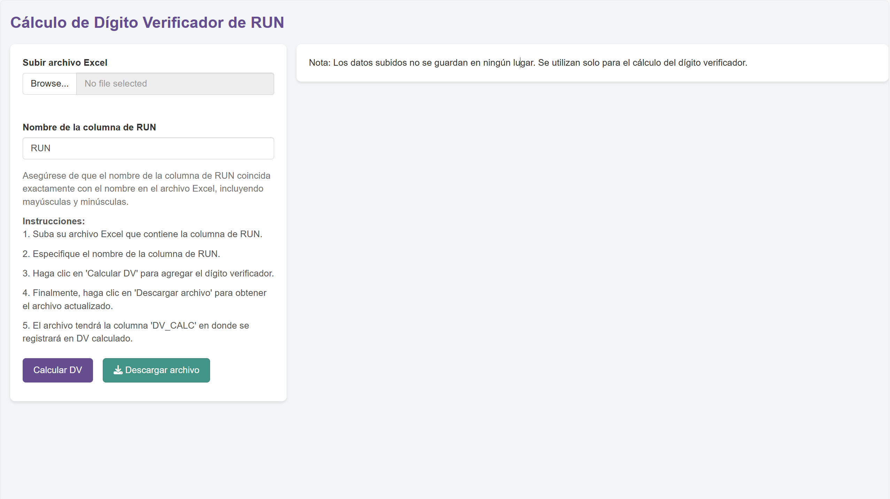

# Calculador de Dígito Verificador de RUN

¡Bienvenido al proyecto Calculador de Dígito Verificador de RUN!

Este es un proyecto de aplicación web desarrollado con R y Shiny que permite calcular el dígito verificador de un RUN (Registro Único Nacional) chileno.

La idea detrás del proyecto es que puedas validar los RUN´s de forma masiva, de forma simple y rápida.

\
**Funcionalidades**

-   Sube un archivo Excel que contenga la columna de RUN

-   Especifica el nombre de la columna de RUN

-   Calcula el dígito verificador de cada RUN y agrega una nueva columna al archivo original

-   Descarga el archivo actualizado con la columna de dígito verificador

**\
Requisitos**

-   R versión 4.4

-   Shiny versión 1.7.1

-   readxl versión 1.3.1

-   DT versión 0.19

-   writexl versión 1.3.1

\
**Notas importantes**

Los datos subidos no se guardan en ningún lugar. Se utilizan solo para el cálculo del dígito verificador. Asegúrate de que el nombre de la columna de RUN coincida exactamente con el nombre en el archivo Excel, incluyendo mayúsculas y minúsculas.